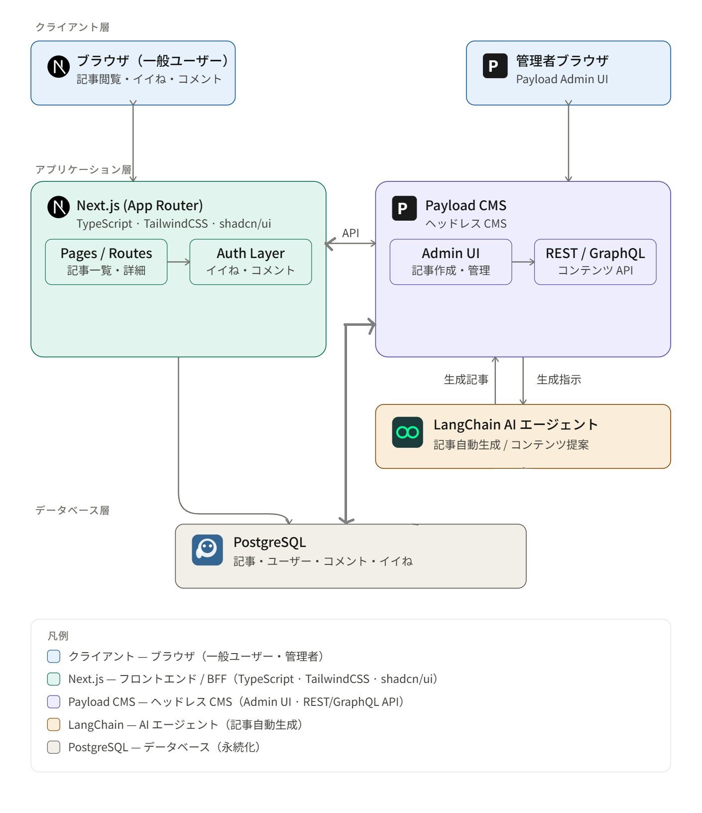

# 概要

- payloadを使用して、ブログ用CMSを作成

## 技術要件

| 技術 | 用途 |
|------|------|
| Next.js | フロントエンド / フルスタックフレームワーク |
| TypeScript | 型安全な開発 |
| TailwindCSS | スタイリング |
| shadcn/ui | UI コンポーネント |
| Payload CMS | ヘッドレス CMS |
| PostgreSQL | データベース |
| LangChain | AIエージェント |

## 実装機能
- 【管理画面】
  - 管理画面での記事作成（Payload Admin UI）
  - AIによる記事自動生成機能
  - LivePreview機能
- 【フロント】
  - フロント画面での記事一覧・詳細表示
  - 認証済みユーザーによる「イイね」機能
  - 認証済みユーザーによるコメント機能

## アーキテクチャ図



## ディレクトリ構成

```sh
blog-cms/
├── src/
│   ├── app/
│   │   ├── (frontend)/          # フロント用ルートグループ
│   │   │   ├── [slug]/
│   │   │   │   └── page.tsx     # 記事詳細ページ
│   │   │   ├── globals.css      # taillwindCSS読み込み
│   │   │   ├── variables.css    # カスタマイズCSS
│   │   │   ├── layout.tsx
│   │   │   └── page.tsx         # 記事一覧ページ
│   │   │    # ※　articles・pages配下省略 #
│   │   ├── (payload)/           # Payload 管理画面（自動生成）
│   │   │   └── admin/
│   │   │   ├── custom.scss      # taillwindCSS読み込み
│   │   │   └── layout.tsx
│   │   ├── api/
│   │   │   ├── comments/
│   │   │   │   └── route.ts     # コメントAPI-Route
│   │   │   ├── generate-content/
│   │   │   │   └── route.ts     # 記事自動生成API-Route
│   │   │   ├── likes/
│   │   │__ │   └── route.ts     # いいねAPI-Route
│   ├── collections/
│   │   ├── Articles.ts
│   │   ├── Comments.ts
│   │   ├── Likes.ts
│   │   ├── Media.ts
│   │   ├── Pages.ts
│   │   ├── Posts.ts
│   │   └── Users.ts
│   ├── components/
│   │   ├── admin/
│   │   │   ├── AIGenerateButtonGenerateButton/
│   │   │   │   └── index.tsx     # 記事自動生成ボタン
│   │   │   ├── CustomDashboard/
│   │   │   │   └── index.tsx     # 管理画面ダッシュボード
│   │   │   ├── CustomNav/
│   │   │   │   └── index.tsx     # 管理画面ナビゲーションバー
│   │   ├── parts/
│   │   │   ├──  LikeButton.tsx
│   │   │   ├──  CommentSection.tsx
│   │   │__ └──  richText.tsx
│   │   　   # ※　その他コンポーネント省略 #
│   └── payload.config.ts         # CMS設定ファイル
├── .env
├── package.json
├── postcss.config.mjs
└── tsconfig.json
```

## CloudCodeによる草案

- [プロジェクト草案](./document/0_草案_プロンプト/1_プロジェクト草案.md)
- [フロント画面（記事一覧）の画面修正提案](./document/0_草案_プロンプト/2_フロント画面修正案01.md)
- [フロント画面（記事詳細）の画面修正提案](./document/0_草案_プロンプト/3_フロント画面修正案02.md)

## 開発について

- [開発手順目次](./document/1_開発手順/開発手順目次.md)

## 【Demo】管理画面（AIによる記事自動生成機能）

[](https://gyazo.com/1cd2bb940dc685cc36b4c51555c021cb)


## 【Demo】フロント画面（いいね・コメント機能）

[](https://gyazo.com/77357118903374fab014b1f663dfe6ad)


## 【Demo】LivePreview機能（パターン１・HTML形式）

[](https://gyazo.com/1bfc992af9879af5164df65037d4ea8c)

## 【Demo】LivePreview機能（パターン２・リッチテキスト形式）

[](https://gyazo.com/fdb472ef740338fd04dc33132c28e603)